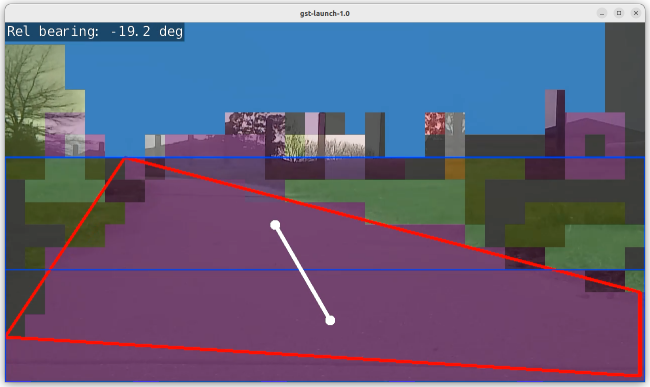

# Semantic Segmentation based navigation for ArduPilot



This program uses an NVIDIA Jetson Nano to provide steering angles to stay on a road or footpath.

Semanatic Segmentation is used to determine where the road or footpath is. Then OpenCV is used for form into
blobs and determine the angle to the centre of the blob.

This angle is coded into a MAVLink message and sent to a connected ArduPilot flight controller.

A video demonstration is available at https://youtu.be/aOMq3tztdVY.

## How it works

This section references the screenshot at the top of this page.

Semantic segmentation is used to separate the captured image into label areas: "Sky, Grass, Road, etc".

The largest area (contour) with a "road" label (purple) is then found (red polygon).

This contour is then split into two - halfway in the horizontal plane (blue boxes).

The centroid of each half is calculated (white points). 

A line is drawn between the two points and the angle calculated (white line).

The angle is put through a 3 point moving average to smooth out any large changes.

This angle is encoded into a MAVLink message ``SET_POSITION_TARGET_LOCAL_NED``, in Body (relative) frame and the
forward velocity and yaw components.


## Using

### Hardware

The following hardware is required:
- Jetson Nano. Other Jetson boards will likely work, but haven't been tested
- Tuned ground rover with an ArduPilot flight controller
- Decent forward-facing camera on the Jetson. I used an IMX219 (Raspberry Pi Camera V2)

A cooling fan may be required on the Jetson in hot environments.

The flight controller should have a telemetry port connected to the Jetson's UART, with a MAVLink router
acting as a bridge between the UART and TCP/UDP connections. Software like Rpanion-server, mavlink-router or
MAVProxy is recommended for this.

## Software

The Jetson Nano is required to have https://github.com/dusty-nv/jetson-inference installed from source. The "apt-get"
version is too old to use. When installing, ensure the applicable Pre-Trained Segmentation Models are downloaded. The
fcn-resnet18-cityscapes-1024x512 dataset is the default (and recommended) used.

The pymavlink, numpy and opencv python3 libraries are also required:

```
pip3 install numpy pymavlink
sudo apt-get install python3-opencv 
```

## Running Standalone

The "segmav.py" script can be used on pre-recorded videos on the Jetson, to test reliability before using on a moving vehicle.

The commandline arguments are:

```
./segmav.py --headless <options> input output
```

The ``<options>`` commandline arguments are:
 - Any input or output options from https://github.com/dusty-nv/jetson-inference/blob/master/docs/aux-streaming.md
 - Plus any segnet options from https://github.com/dusty-nv/jetson-inference/blob/master/docs/segnet-console-2.md

Where the ``input`` and ``output`` video streams are the same
as https://github.com/dusty-nv/jetson-inference/blob/master/docs/aux-streaming.md

If the output is a ``file://``, a timestamp will automatically added to the file name

For example:

```
./segmav.py --headless --input-codec=H264 file://record-20230422-145739.mp4 rtp://192.168.1.124:5400
```

Which will read an input video file, perform processing and output to an RTP stream.

On Ubuntu, use the following command to view the video:

```
gst-launch-1.0 udpsrc port=5400 caps='application/x-rtp, media=(string)video, clock-rate=(int)90000, encoding-name=(string)H264' ! rtpjitterbuffer ! rtph264depay ! h264parse ! avdec_h264 ! videoconvert ! autovideosink sync=false
```

The segmav console will output the calculated delta heading to stay on the path or road. The heading is in degrees, negative for
counter-clockwise and positive for clockwise. The heading is contstrained to +-90 degrees.

## Running on a live system

Use the "mavsegmav.py" script to run on a live system. For example:

```
mavsegmav.py <options> input output
```

Where the ``input`` and ``output`` video streams are the same
as https://github.com/dusty-nv/jetson-inference/blob/master/docs/aux-streaming.md

If the output is a ``file://``, a timestamp will automatically added to the file name

The ``<options>`` commandline arguments are:
 - ``--rc``: The RC channel number to monitor for control signals. Defaults to RC10
 - ``--pwmlow``: The RC low PWM value. Defaults to 1000
 - ``--pwmmid``: The RC mid PWM value. Defaults to 1500
 - ``--pwmhigh``: The RC high PWM value. Defaults to 2000
 - ``--device``: MAVLink connection string. Can be serial, TPC or UDP connection
 - ``--baud``: MAVLink baud rate, if using serial connection
 - ``--vel``: Foward velocity setpoint in m/s.
 - Plus any input or output options from https://github.com/dusty-nv/jetson-inference/blob/master/docs/aux-streaming.md
 - Plus any segnet options from https://github.com/dusty-nv/jetson-inference/blob/master/docs/segnet-console-2.md


So, for example:

```
mavsegmav.py --input-flip=rotate-180 --rc=9 --vel=2.5 --device=/dev/ttyTHS1 --baud=57600 csi://0 rtp://192.168.1.124:5400
```

Will take in video from the CSI0 port, rotate 180 degrees, process it to determine to correct steering angle and output
the MAVLink messages to the ``/dev/ttyTHS1`` UART at 57600 baud. It will monitor RC channel 9 for start and stop commands.
It will also command a 2.5m/s forward velocity. The processed video stream will be stream via RTP to ``192.168.1.124:5400``

An RC controller channel is used to control the state of mavsegmav:
 - On RC LOW (1000 PWM), the system will stop and vision processing and send a halt command to the vehicle
 - On RC MID (1500 PWM), the system will record video to file. This is useful for capturing test datasets
 - On RC HIGH (2000 PWM), the system will send heading and speed commands to the flight controller. The vehicle must be in
   the Armed state. mavsegmav will automatically switch to guided mode.

If a buzzer is fitted to the flight controller, a tune will sound each time one of the above actions is switched to.

Note the segmentation may take ~10 seconds to start up or stop after a RC switch action. MAVLink ``STATUSTEXT`` messages will also
be sent to any connected ground stations annoncing the start or stop.

For automatic operation, a supplied systemd service "segmav.service" can be used. Ensure to change the path or username details
to match your system.
